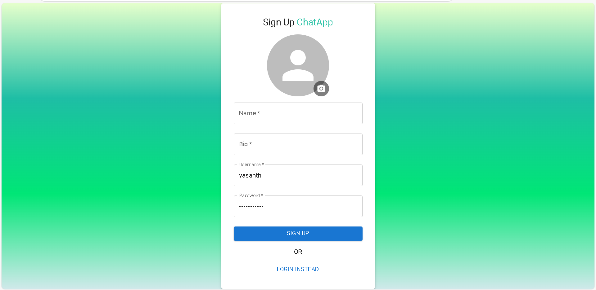
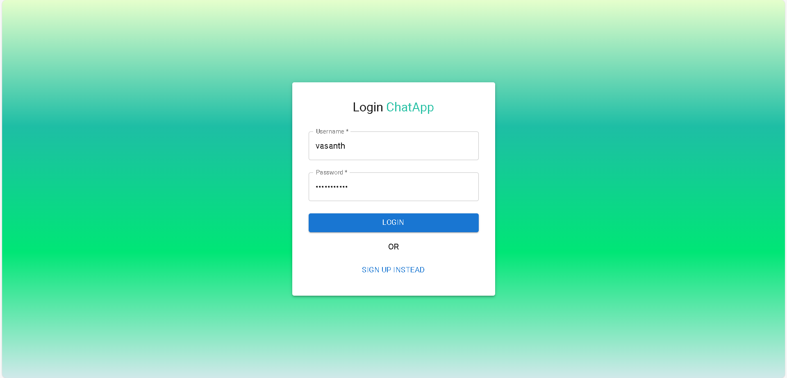
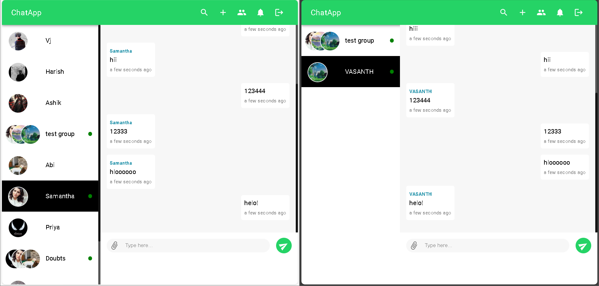
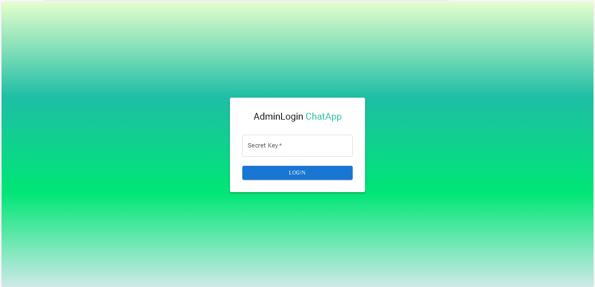
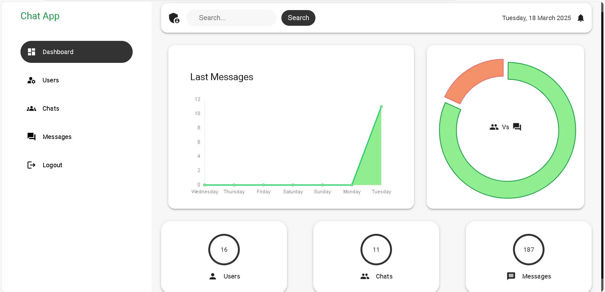

# 🗨️ Real-Time Chat Application with Admin Panel (MERN + Socket.IO)

📌 **A full-stack real-time chat application** built with the **MERN Stack** (MongoDB, Express.js, React, Node.js) and **Socket.IO** for instant messaging. Includes **JWT authentication**, **role-based access control (RBAC)**, and an **admin panel** to manage users & messages.

---

## 🚀 Features

✅ **Real-Time Messaging** – Instant chat updates powered by **Socket.IO**  
✅ **User Authentication** – Secure login & JWT-based authorization  
✅ **Role-Based Access Control (RBAC)** – Admin & user privileges  
✅ **Admin Panel** – Manage users, messages & system settings  
✅ **Online Status Tracking** – Displays active users in real-time  
✅ **Redux Toolkit Integration** – Efficient global state management  
✅ **Error Handling** – Proper validations on frontend & backend  
✅ **Responsive UI** – Optimized for all screen sizes  
✅ **Deployment** – **Frontend:** Vercel | **Backend:** Render  

---

## 🛠️ Tech Stack

**Frontend:**  
🖥️ React.js, Redux Toolkit, Mui Material  

**Backend:**  
⚙️ Node.js, Express.js, MongoDB  

**Real-Time Communication:**  
🔄 Socket.IO  

**Authentication & Security:**  
🔒 JWT (JSON Web Tokens)  

**Hosting & Deployment:**  
🌍 **Frontend:** Vercel | **Backend:** Render  

---

## 🚀 Demo Login Instructions

To test the app with multiple users, follow these steps:

### 1️⃣ Available Demo Accounts
Use the following demo logins:

**User 1**  
📛 Username: `user1`  
🔑 Password: `User@1`  

**User 2**  
📛 Username: `user2`  
🔑 Password: `User@2`  

### 2️⃣ How to Test Multiple Users?

1. Open a normal browser window and log in as **User1**.
2. Open a private/incognito window and log in as **User2**.

**Shortcut:**  
📌 **Windows/Linux:** `Ctrl + Shift + N`  
📌 **Mac:** `Cmd + Shift + N`  

Now, test the **Find People** feature in Search:

- User1 should **not** see themselves in search results.
- User2 should **not** see themselves either.
- Users already in a chat should **not** appear in search.
- Users can remove a friend by right-clicking on their name in the chat or friends list.
- The friend will be removed from your list.

---

## 📸 Screenshots
  
  
 
  
  

---

